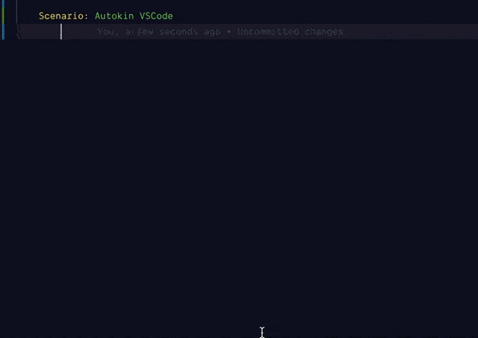
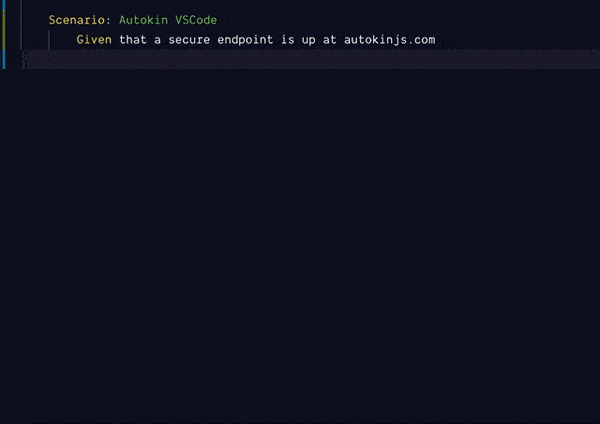

# Autokin VSCode Snippets

This extension contains code snippets for [Autokin][autokin] to help Autokin developers to easily add Autokin Gherkin statements.

## Installation

In order to install an extension you need to launch the Command Pallete (`Ctrl + Shift + P` or `Cmd + Shift + P`) and type Extensions. Then search for `Autokin VSCode`.

## Usage
After installation, you may now use the Gherkin keyword `Given`, `Then`, and `When` to help you autocomplete some of the Autokin Gherkin statements. 

You may also use shortcuts for all of the snippets as described below.

## Snippets

Press `TAB` (`→`) key to trigger the snippet completion. For example, if I want to include `When I GET`, I will type `whget` then followed by a `TAB` (`→`) key 

|  Trigger   | Content                                                                   |
| ---------: | ------------------------------------------------------------------------- |
|  `whget→`  | When I GET                                                                |
|  `whpost→` | When I POST to                                                            |
|  `whput→`  | When I PUT to                                                             |
|  `whdel→`  | When I perform DELETE to                                                  |
|  `whpat→`  | When I PATCH to                                                           |
|  `gvds→`   | Given that a secure endpoint is up at                                     |
|  `gvd→`    | Given that a endpoint is up at                                            |
|  `gvsh→`   | Given I set {name} header to {value}                                      |
|  `gvfh→`   | Given I set {name} header from {stored value name}                        |
|  `gvhs→`   | Given I set headers to                                                    |
|  `gvqs→`   | Given I set query parameters to                                           |
|  `gvsq→`   | Given I set query parameter {name} to {value}                             |
|  `gvfp→`   | Given I set query parameter {name} from {stored value name}               |
|  `gvjb→`   | Given I set the JSON body to                                              |
|  `gvcp→`   | Given I set the cookie to {cookie value pair}                             |
|  `gvsc→`   | Given I set the cookie {name} to {value}                                  |
|  `gvfc→`   | Given I set the cookie {name} from {stored value name}                    |
|  `gvau→`   | Given I have basic authentication credentials {username} and {password}   |
|  `gvtk→`   | Given I set the bearer token to {token}                                   |
|  `gvtkf→`  | Given I set the bearer token with {stored value name}                     |
|  `thc→`    | Then response status code should be {expected status code}                |
|  `thnc→`   | Then response status code should not be {expected status code}            |
|  `thhx→`   | Then response header {name} should exist                                  |
|  `thhnx→`  | Then response header {name} should not exist                              |
|  `thhv→`   | Then response header {name} should be {expected value}                    |
|  `thhnv→`  | Then response header {name} should not be {expected value}                |
|  `thjbv→`  | Then response body should be valid json                                   |
|  `thjbc→`  | Then response body should be json data of                                 |
|  `thpv→`   | Then I expect that path {path} from body has value of {expected value}    |
|  `thbp→`   | Then response body should have path {path}                                |
|  `thlt→`   | Then response time is not greater than {response time}ms                  |
|  `thgt→`   | Then response time is greater than {response time}ms                      |
|  `thkpv→`  | Then I keep the value of body path {path} as {storage name}               |
|  `thkhv→`  | Then I keep the value of header {name} as {storage name}                  |
|  `thxsv→`  | Then I expect that the stored value in {storage name} is {expected value} |        
|  `thxsch→` | Then I expect response data schema complies to {schema path}              |        

Thanks to [babelsublime] for awesome documentation format. :)  
Language .feature format from [cucumber-tmbundle]. 

[autokin]: http://autokinjs.com
[babelsublime]: https://github.com/babel/babel-sublime-snippets
[cucumber-tmbundle]: https://github.com/cucumber/cucumber-tmbundle
